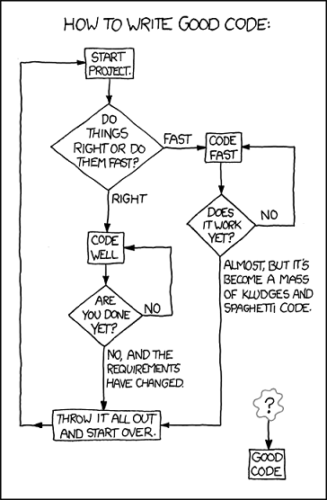

@size[40pt](@color[#FF694B](**Enterprise role-play**)@color[#333F48](: Dress up your Ansible roles with great tests))

@snap[south]
@size[18pt](Jake Remitz | Lead Software DevOps Engineer) <br />
@size[14pt](@fa[github] @fa[twitter-square] @jremitz)
@snapend

Note:

- Jake Remitz - Lead Software DevOps Engineer
- Talk about testing you infrastructure as code (Ansible) in an Enterprise environment
    - reusable, scalable code

---

@fa[question-circle fa-3x]
### Who’s testing their infrastructure as code and how?

+++
### Ansible Core on Testing...

[Ansible Testing Strategies](https://docs.ansible.com/ansible/latest/test_strategies.html)

> @size[22pt](Ansible believes you should not need another framework to validate basic things of your infrastructure is true. This is the case because Ansible is an order-based system that will fail immediately on unhandled errors for a host, and prevent further configuration of that host. This forces errors to the top and shows them in a summary at the end of the Ansible run...)

+++

#### XKCD: Good Code



@snap[south-west]
@size[18pt](https://xkcd.com/844/)
@snapend

@snap[east]
@size[12pt](<p><I>"You can either hang out in the<br> Android loop or the HURD loop"<br>-Randall Munroe</I></p>)
@snapend

Note:

- Given requirements: right or fast?
- Right side: fast
- Left: "Right" - neverending
- Humor aside - we drive to "good code" with the tools Ansible gives us: modules/features

+++

### Ansible-specific Testing
<br /> 
##### Syntax Check
 
```sh
ansible-playbook playbook.yml -i hosts --syntax-check
```

@css[page-note](Not much of a "test" - but it's a good sanity check to start)

Note:

- Good for sanity check before merging.
- When you have no other options, it's <I>something</I>

+++
##### Check Play

```sh
ansible-playbook playbook.yml -i hosts --check
```

@css[page-note](Good dry run but may fail for some downstream tasks with dependencies - package install, for example<br>Helpful with --tag and --diff to target and troubleshoot changes)

Note:

- Getting somewhere, running against inventory
- No validation of quality of install
- Some tests fail depending on dependencies for changes

+++

##### Helpful Features

###### Modules

- `wait_for`

```yml
tasks:

  - wait_for:
      host: "{{ inventory_hostname }}"
      port: 22
    delegate_to: localhost
```
+++

###### Modules (cont'd)

- `uri`

```yml
tasks:

  - uri: url=http://www.example.com return_content=yes
    register: webpage

  - fail:
      msg: 'service is not happy'
    when: "'AWESOME' not in webpage.content"
```

+++
**Modules**

- `stat`
- `assert (that)`

```yml
tasks:

   - stat:
       path: /path/to/something
     register: p

   - assert:
       that:
         - p.stat.exists and p.stat.isdir
```

Note:

code <I>smarter</I>, use the modules
- `wait_for:` - ports, services - https://docs.ansible.com/ansible/latest/modules/wait_for_module.html#examples
- `uri:` - essentially curl, test services
- `stat:` - file system status
- `assert (that)` - test condition https://docs.ansible.com/ansible/latest/modules/assert_module.html#examples

+++

**Loops**
- Do-Until

```yml
- shell: /usr/bin/foo
  register: result
  until: result.stdout.find("all systems go") != -1
  retries: 5
  delay: 10
```

+++?code=src/ansible/elk.yml&title=Elasticsearch Example Health Check

---

## Testing Tools

- Serverspec - https://serverspec.org/
- GOSS - https://goss.rocks
- InSpec - https://www.inspec.io/
- Testinfra - https://testinfra.readthedocs.io/en/latest/

+++

## Testing Orchestrators

- KitchenCI (“Test Kitchen”) - https://kitchen.ci/
- Molecule - http://molecule.readthedocs.io/

<br />

@css[page-note](Pre-built flow of common testing techniques: lint, syntax, create, converge, verify, destroy)

---

## Molecule

> Orchestrate the end-to-end testing of your ansible roles including dependencies, infrastructure provisioning, and playbook execution.

@css[page-note](Supports: Azure, Docker, EC2, GCE, LXC, LXD, Openstack, Vagrant, and others)
+++

### Uses

- lint
- syntax
- dependencies
- check
- provision
- idempotency
- verify

[Molecule Usage](https://molecule.readthedocs.io/en/latest/usage.html)

+++

### Demo

Note:

- `molecule help`
- **Greenfield**: `molecule init role -r test-role -d docker --lint-name yamllint --verifier-name testinfra`
- **Brownfield**: `molecule init scenario -r test-role -d docker --lint-name yamllint --verifier-name testinfra`

---

### Final Thoughts

@ul

- Writing "good code" will get you most of the way there - use Ansible modules!
- Too many checks in roles/plays will slow down your runtime and complicate your code, is it worth it?
- Using a test orchestrator like Molecule can assist in life cycle testing to ensure "good code" for multiple scenarios and enforce standards like linting, idempotency, and cross-platform support
- Add CI/CD around code changes for quality assurance!

@ulend
